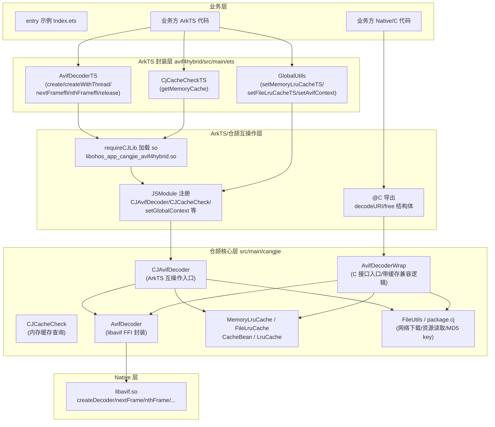
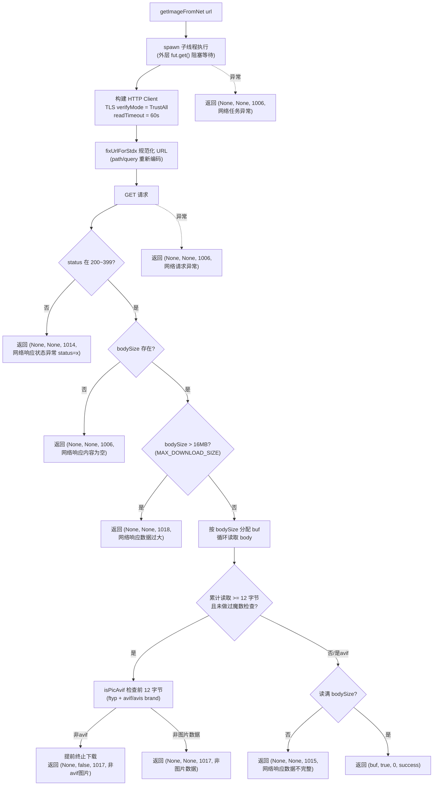
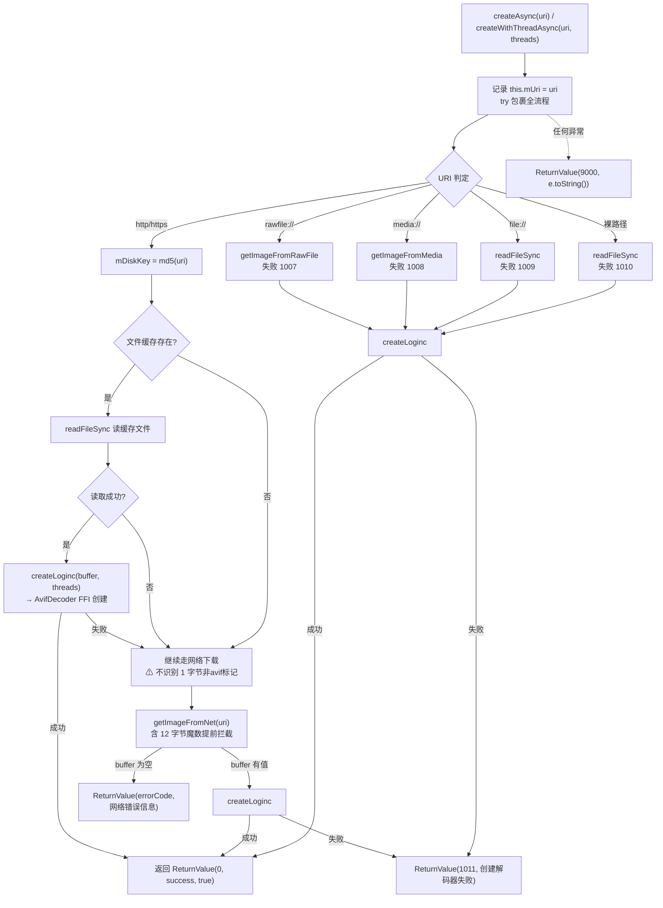
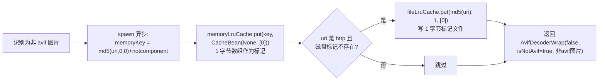
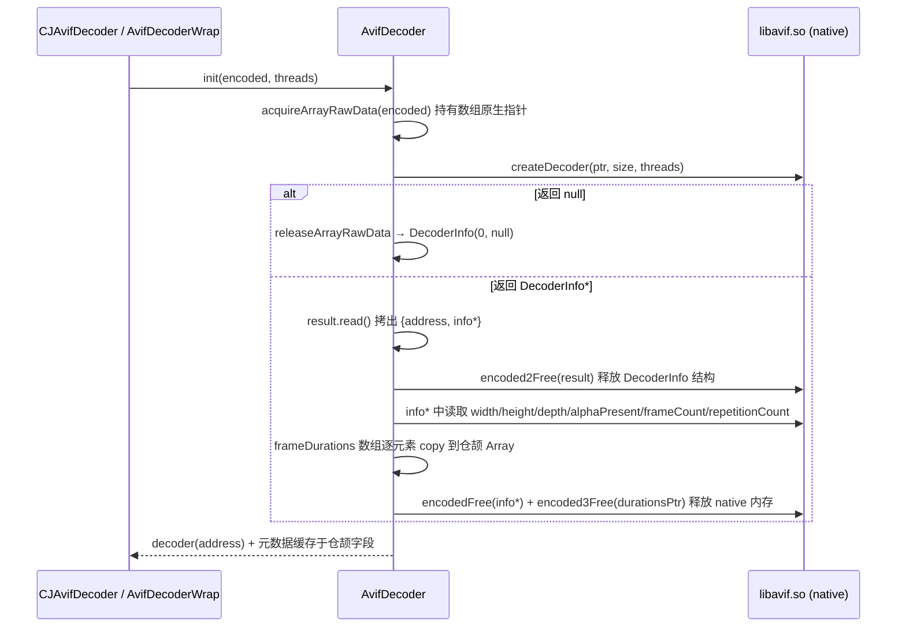
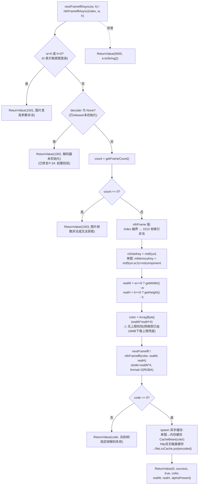
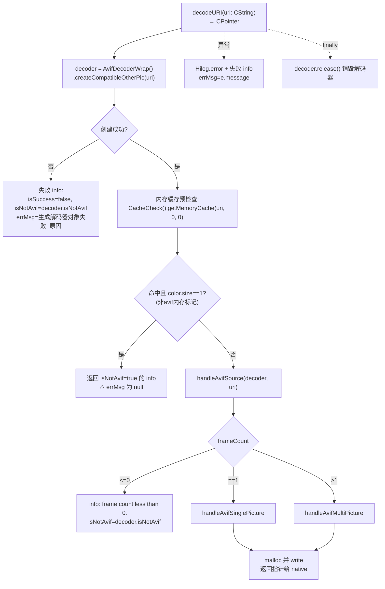
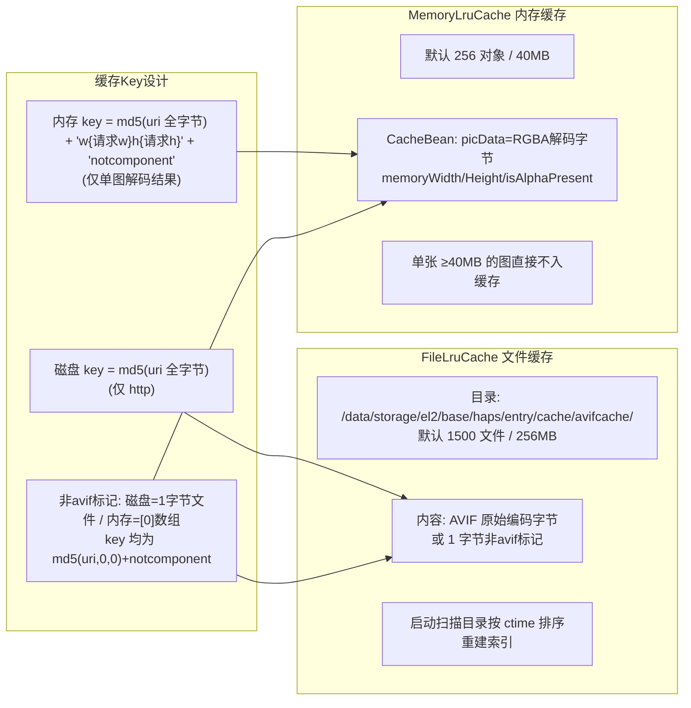
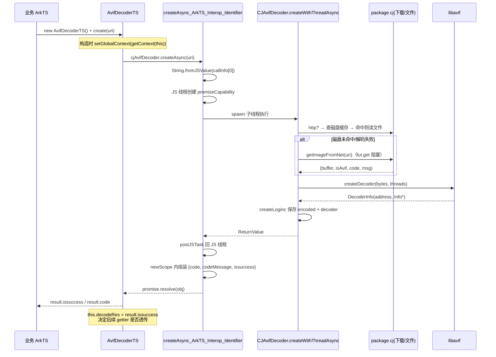
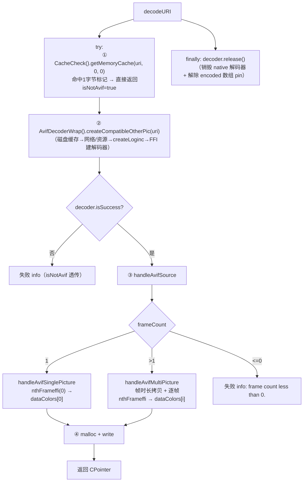

# AVIF 功能代码逻辑分析梳理文档

> 分析对象：`avif-ffi` 仓库（ArkTS 互操作版本 + 仓颉 C 接口版本）
> 分析范围：图片资源下载机制、解码器创建流程、单图/多图解码实现、双层缓存策略
> 文档目的：帮助开发团队全面理解 AVIF 功能实现细节，识别潜在风险，为后续优化提供依据

---

## 目录

1. [功能概述与整体架构](#1-功能概述与整体架构)
2. [核心模块逻辑分析](#2-核心模块逻辑分析)
   - 2.1 图片资源获取与下载机制
   - 2.2 解码器创建流程
   - 2.3 解码实现（单图/多图/逐帧）
   - 2.4 缓存策略设计
3. [ArkTS 版本关键接口深度分析](#3-arkts-版本关键接口深度分析)
4. [仓颉版本 decodeURI 接口深度分析](#4-仓颉版本-decodeuri-接口深度分析)
5. [错误处理与资源释放机制](#5-错误处理与资源释放机制)
6. [两版本行为差异对照](#6-两版本行为差异对照)
7. [潜在问题清单](#7-潜在问题清单)
8. [改进建议汇总](#8-改进建议汇总)
9. [附录](#9-附录)

---

## 1. 功能概述与整体架构

### 1.1 功能概述

avif-ffi 是一款在鸿蒙（HarmonyOS）侧显示 AVIF 图片的库，支持静态图与动态图（动画序列帧），核心能力包括：

- **多来源图片获取**：网络（http/https）、rawfile 资源、media 资源、沙箱文件（file://）、裸路径
- **AVIF 解码**：基于 libavif（`libavif.so`）通过仓颉 FFI 完成解码，输出 RGBA8888 像素数据
- **非 AVIF 图片兼容**：识别非 AVIF 图片并标记（`isNotAvif`），供业务侧降级到系统解码
- **双层缓存**：内存 LRU 缓存（仅单图解码结果）+ 文件 LRU 缓存（仅 http 来源的编码原始数据）
- **双形态对外接口**：
  - **ArkTS 互操作版本**：ArkTS 业务通过 `AvifDecoderTS` 类调用（`cj_avifimage.ets` → 仓颉 `CJAvifDecoder`）
  - **仓颉 C 接口版本**：Native/C 侧通过 `@C` 导出的 `decodeURI` 一次调用完成"取图→解码→产出全部帧"

### 1.2 整体架构分层



**关键源文件索引**：

| 文件 | 职责 |
|---|---|
| `avif4hybrid/src/main/ets/pages/cj_avifimage.ets` | ArkTS 侧封装类（AvifDecoderTS / CjCacheCheckTS / GlobalUtils） |
| `avif4hybrid/src/main/cangjie/cj_avifdecoder.cj` | ArkTS 互操作版解码器（createAsync / nextFrameffiAsync / nthFrameffiAsync） |
| `avif4hybrid/src/main/cangjie/cj_cache_check.cj` | ArkTS 互操作版内存缓存查询 |
| `avif4hybrid/src/main/cangjie/main.cj` | C 接口版入口 `decodeURI`、单图/多图帧处理、`AvifDecodeInfo` 结构 |
| `avif4hybrid/src/main/cangjie/avif_decoder_wrap.cj` | C 接口版解码器包装（含非 AVIF 兼容与缓存写入） |
| `avif4hybrid/src/main/cangjie/avif_decoder.cj` | libavif FFI 声明与 `AvifDecoder` 类 |
| `avif4hybrid/src/main/cangjie/package.cj` | 全局缓存实例、网络下载 `getImageFromNet`、MD5 key、rawfile/media 读取、AVIF 魔数判断 |
| `avif4hybrid/src/main/cangjie/memory_lru_cache.cj` / `file_lru_cache.cj` / `lru_cache.cj` | 双层缓存实现 |
| `avif4hybrid/src/main/cangjie/cachebean.cj` / `retvalue.cj` / `info.cj` / `decoder_info.cj` / `cjinfo.cj` | 数据结构定义 |
| `avif4hybrid/src/main/cangjie/index.cj` / `common.cj` / `scope.cj` / `iamge_extend.cj` | JSModule 注册、全局 Context、scope 工具 |

---

## 2. 核心模块逻辑分析

### 2.1 图片资源获取与下载机制

#### 2.1.1 URI 分发规则

两个版本（`CJAvifDecoder.createWithThreadAsync` 与 `AvifDecoderWrap.createWithThreadCompatibleOtherPic`）均按 URI 前缀分发：

| URI 形态 | 处理方式 | 失败错误码 |
|---|---|---|
| `http` / `https` 开头（不区分大小写） | 先查文件缓存 → 未命中走网络下载 `getImageFromNet` | 1014/1015/1017/1006（网络类） |
| `rawfile://xxx` | `ResourceManager.getRawFileContent`（需先 `setGlobalContext`） | 1007 |
| `media://xxx[.avif]` | `ResourceManager.getMediaByName`（自动去除 `.avif` 后缀） | 1008 |
| `file://路径` | `FileUtils.readFileSync` 读沙箱文件 | 1009 |
| 其他（裸路径） | `FileUtils.readFileSync` 按本地路径读 | 1010 |

#### 2.1.2 网络下载流程（`package.cj:90 getImageFromNet`）



**关键设计点**：

1. **流式提前终止**：下载循环内一旦累计读满 12 字节即做 AVIF 魔数校验（`package.cj isPicAvif`），非 AVIF 图片在网络层提前中断，避免下载完整文件——这是"兼容其他图片格式"的核心优化。
2. **魔数判断规则**：校验 `fileData[4..8] == "ftyp"` 且 brand 为 `avif`/`avis`（第 12 字节 `f` 或 `s`）；`fileData[0] == 60`（`<`）判定为 HTML 响应（"非图片数据"）。
3. **同步等待模型**：`spawn` 后立即 `fut.get()`，即调用线程阻塞至下载完成；ArkTS 互操作层的外层 `spawn` 保证不阻塞 JS 线程。
4. **URL 规范化** `fixUrlForStdx`：用 stdx 的 `URL` 对 path/query 重新编码，规避 stdx http 客户端对特殊字符的处理差异。
5. **下载体积上限（已修复 P-03/P-26）**：`MAX_DOWNLOAD_SIZE = 16MB`（`package.cj`），bodySize 超限直接返回 1018，不再按声明值预分配缓冲——防恶意/异常服务器声明超大 Content-Length 引发 OOM。

#### 2.1.3 AVIF 魔数判断（`isPicAvif`）

```
偏移:  0    1    2    3    4    5    6    7    8    9    10   11
字段: [ size(4B)   ] 'f'  't'  'y'  'p'  'a'  'v'  'i'  'f'/'s'
```

- 命中 `ftypavif` / `ftypavis` → `(true, "avif图片")`
- 首字节为 `<`（0x3C）→ `(None, "非图片数据")`（疑似 HTML/错误页）
- 其他 → `(false, "非avif图片")`
- 数据不足 12 字节 → `(None, "非图片数据")`

### 2.2 解码器创建流程

#### 2.2.1 ArkTS 版（`cj_avifdecoder.cj:62 createWithThreadAsync`）



**`createLoginc`（`cj_avifdecoder.cj:738`）**：
- 保存 `encoded = buffer`（原始编码数据，供后续 `isAvifImageffi` 与文件缓存写入复用）
- `decoder = AvifDecoder(buffer, threads)` 调 FFI 创建解码器
- 通过 `k.decoder == 0` 判断创建失败，返回 `None`

**线程模型**：互操作层 `createAsync_ArkTS_Interop_Identifier`（`cj_avifdecoder.cj:381`）在 JS 线程创建 Promise，`spawn` 到仓颉线程执行创建流程，完成后 `postJSTask` 回 JS 线程 resolve——下载/解码均不阻塞 UI。

**threads 参数语义**（文档约定，代码未校验）：`<0` 取 CPU 核心数；`==0` 取 `min(核心数, 2)`；`>0` 且不超过核心数。该参数直接透传给 native `createDecoder`。

#### 2.2.2 仓颉 C 接口版（`avif_decoder_wrap.cj:34 createWithThreadCompatibleOtherPic`）

与 ArkTS 版结构相似，但有两处**关键增强**（差异详见第 6 节）：

1. **文件缓存命中时识别非 AVIF 标记**：缓存文件大小为 1（内容 `[0]`，即"非 avif 标记文件"）时，直接返回 `createLogincCompatibleOtherPic2()`，**不再发起网络请求**。
2. **缓存解码失败自动降级**：缓存文件存在但解码失败（缓存损坏）时，`if(decoderWrap.isSuccess)` 不成立则继续走网络下载重新获取。
3. **网络下载结果识别 `isAvif` 标志**：`getImageFromNet` 返回 `(None, false, ...)` 时走非 AVIF 标记缓存路径。

**非 AVIF 标记缓存（`createLogincCompatibleOtherPic2`，`avif_decoder_wrap.cj:134`）**：



**缓存了什么数据——标记语义**：非 AVIF 图片并不缓存图片内容，而是缓存一个 **1 字节 `[0]` 的哨兵值**（内存 CacheBean.picData 或磁盘文件），用于下次快速返回"非 avif"结论，避免重复网络请求。

#### 2.2.3 FFI 解码器创建（`avif_decoder.cj:53/80`）



- native 句柄以 `Int64 address` 形式保存于 `AvifDecoder.decoder`
- 解码所需的 `encoded` 数组通过 `CPointerHandle` 长期 pin 住（`handle` 字段），`release()` 时 `releaseArrayRawData` 解除 pin 并 `destroyDecoder` 销毁 native 解码器
- 元数据（宽高/深度/alpha/帧数/重复次数/帧时长）在创建时一次性读出并缓存在仓颉字段，后续 getter 不再跨 FFI

### 2.3 解码实现

#### 2.3.1 ArkTS 版逐帧解码（`nextFrameffiAsyncInternal` / `nthFrameffiAsyncInternal`）



**参数与返回值说明**：

| 参数 | 类型 | 含义与约束 |
|---|---|---|
| `imageWidth` / `imageHeight` | Int32 | 目标解码宽高；`0` 表示取原图宽高；`<0` 非法（1001）。同时是内存缓存 key 的组成部分 |
| `index`（仅 nthFrame） | Int32 | 帧索引，`0` 起；越界返回 1012。**单图（count==1）时强制解码第 0 帧，index 被忽略** |
| 返回 `CJReturnValue` | 对象 | `code`（状态码）、`codeMessage`、`issuccess`、`color`（RGBA 字节序列→ArrayBuffer）、`memoryWidth/memoryHeight`（实际解码宽高，供构造 PixelMap）、`isAlphaPresent` |

**关键设计点**：

1. **内存缓存 key 一致性约定**：`mMemoryKey = md5(uri, w, h) + "notcomponent"` 使用的是**业务传入的请求宽高**（非 realW/realH）。业务查缓存（`getMemoryCache(uri, w, h)`）与写缓存必须传相同宽高值才能命中；传 `(0,0)` 是约定俗成的"原图"键。
2. **像素格式固定** RGBA8888（`format=2`，每像素 4 字节），`stride = imageWidth * 4`。
3. **alpha 非预乘**：注释明确 `alphaPremultiplied` 为 `AVIF_FALSE`，`isAlphaPresent` 随返回值透传，由业务侧构造 PixelMap 时决定 alpha 类型，避免透明图显示全黑/灰。
4. **成功后异步写缓存**：`spawn` 中仅单图写内存缓存、仅 http 来源写文件缓存（先 `exist` 检查防重写）。

#### 2.3.2 仓颉 C 接口版一次性解码（`main.cj:182 decodeURI`）

`decodeURI` 是"全量解码"接口：一次调用产出**全部帧**的像素数据，通过 `@C` 结构体 `AvifDecodeInfo` 返回给 native 调用方。



**单图处理（`main.cj:25 handleAvifSinglePicture`）**：

1. 校验宽高非 0（`width/height == 0` → "width and height is invalid."）
2. `dataColors = malloc<CPointer<UInt8>>(1)`（帧指针数组，长度 1）
3. `pixelMapSize = width * height * 4`，`dst = malloc<UInt8>` 像素缓冲
4. `decoder.nthFrameffi(0, dst, w, h)` 解码第 0 帧；成功则 `dataColors[0] = dst`
5. 每一步 malloc 失败均回滚已分配内存并返回 errMsg

**多图处理（`main.cj:88 handleAvifMultiPicture`）**：

1. 同样校验宽高；读取 `frameCount`、`repetitionCount`
2. **帧时长一致性校验**：`frameDurations.size != frameCount` → "FrameDurations should be equal to frameCount."
3. `frameDurations` 拷贝到 `malloc<Float64>` 数组
4. `dataColors = malloc<CPointer<UInt8>>(frameCount)`，**先整体清零所有槽位**（防止失败路径 `free(info)` 读到未初始化垃圾指针）
5. 循环逐帧：每帧 `malloc` `w*h*4` 缓冲 → `nthFrameffi(idx, ...)` → 成功写入槽位；任何一帧失败则 `free(info)` 回滚全部已解码帧并返回带帧号的 errMsg
6. 全部成功 → `isSuccess=true, isSinglePic=false`

**内存所有权**：`AvifDecodeInfo` 中 `errMsg`（CString）、`frameDurations`（Float64 数组）、`dataColors`（帧指针数组及各帧像素缓冲）均为 `LibC.malloc` 分配的 native 堆内存，所有权转移给调用方。

### 2.4 缓存策略设计

#### 2.4.1 总体结构



#### 2.4.2 缓存了什么数据（汇总）

| 缓存层 | 触发路径 | Key | Value | 写入时机 |
|---|---|---|---|---|
| 内存缓存 | ArkTS 版 `nextFrameffiAsync/nthFrameffiAsync` **单图**解码成功后 | `md5(uri)+w{w}h{h}+notcomponent` | `CacheBean{picData: RGBA8888 解码字节, memoryWidth/Height, isAlphaPresent}` | 解码成功后 `spawn` 异步写入 |
| 内存缓存 | 仓颉版识别非 avif | `md5(uri,0,0)+notcomponent` | `CacheBean{picData: [0]}`（哨兵） | `createLogincCompatibleOtherPic2` spawn 写入 |
| 文件缓存 | ArkTS 版帧解码成功后（仅 http） | `md5(uri)` | AVIF 原始编码字节（`encoded`） | 解码成功后 `spawn`，`exist` 防重 |
| 文件缓存 | 仓颉版识别非 avif（仅 http） | `md5(uri)` | 1 字节 `[0]` 标记文件 | 同上 |
| 多图（动画） | — | — | **不写内存缓存**（内存占用过大，设计如此）；文件缓存正常写 | — |

#### 2.4.3 淘汰策略与读取路径

- **`LruCache`（`lru_cache.cj:32`）**：基于 `ArrayList<CacheItem>` 的顺序表，`put` 时若 key 已存在则移除旧项后尾插；`get` **不更新访问位置**——因此严格来说是 **FIFO（按插入顺序淘汰）而非真 LRU**。`keys()[0]` 即最旧项，`trimToSize` 从头淘汰。
- **`MemoryLruCache.put`**（`memory_lru_cache.cj:42`）：互斥锁保护；条目数满且新 key → 淘汰 `keys()[0]`；key 已存在 → 先移除旧值（扣减字节统计）；新值字节数 `>= maxMemory` 则**静默丢弃不入缓存**；写入后 `trimToSize` 按字节总量循环淘汰。
- **`FileLruCache`**（`file_lru_cache.cj`）：
  - 构造时 `initFileCache` 扫描缓存目录，按文件 `ctime` 升序（`CacheFileInfo` 稳定排序）重建内存索引，超出 `maxFileSize` 或 `maxMemorySize` 的旧文件直接删除
  - `put`：淘汰/去重后写索引并 `writeDataSync` 落盘
  - `get`：索引命中后 `readFileSync` 读文件（**不更新访问位置**）
- **读取链路**（以 ArkTS 版创建为例）：磁盘缓存命中 → 直接 `createLoginc` 建解码器（免网络）；未命中 → 网络下载 → 解码成功后回写磁盘缓存。

#### 2.4.4 全局实例与配置

- `package.cj:44-45`：模块加载即创建全局单例 `memoryLruCache = MemoryLruCache(256, 40MB)`、`fileLruCache = FileLruCache(1500, 256MB)`（构造时会同步扫盘）。
- 业务可通过 `GlobalUtils.setMemoryLruCacheTS / setFileLruCacheTS`（`common.cj`）在运行期调整上限，超范围参数回退默认值。
- 内存缓存容量上限保护：`maxSize ≤ 65536`，`maxMemory ≤ 10GB`。

---

## 3. ArkTS 版本关键接口深度分析

> 说明：`cj_avifdecoder.cj` 虽为仓颉源码，但其定位是 **ArkTS 互操作版本**——通过 `JSModule.registerClass` 将 `CJAvifDecoder` 暴露给 ArkTS 侧，ArkTS 业务经 `AvifDecoderTS`（`cj_avifimage.ets:8`）调用。

### 3.1 createAsync



**参数传递机制**：
- 互操作层 `String.fromJSValue(context, callInfo[0])` 单参数转换（无参数个数/类型校验）
- `createAsync(uri)` 等价于 `createWithThreadAsync(uri, 1)`（单线程解码）

**返回值处理**：
- 仅 `code/codeMessage/issuccess` 三字段（create 类接口不返回像素数据）
- `AvifDecoderTS.create` 将 `issuccess` 记录到 `this.decodeRes`，后续 `getWidth()` 等同步 getter 在 `decodeRes == false` 时直接返回 0/undefined，形成"未成功创建则不透传"的短路保护

### 3.2 nextFrameffiAsync（nthFrameffiAsync 同构）

**线程模型**：

```mermaid
sequenceDiagram
    participant Biz as 业务 ArkTS
    participant IC as nextFrameffiAsync_...Identifier
    participant CJ as nextFrameffiAsyncInternal
    participant N as libavif
    participant SP as spawn 缓存线程

    Biz->>IC: await nextFrameffi(w, h)
    IC->>IC: Int32.fromJSValue ×2（无校验）
    IC->>CJ: spawn 子线程执行
    CJ->>CJ: 校验(1001/1003/1012) → 计算 key → 定 realW/H
    CJ->>CJ: color = Array[Byte](realW*realH*4)
    CJ->>N: nextFrame(decoder, colorPtr, w, h, stride=w*4, RGBA)
    N-->>CJ: code
    alt code == 0
        CJ->>SP: spawn{单图→memoryLruCache.put; http→fileLruCache.put}
        CJ-->>IC: ReturnValue(0, success, true, color, w, h, alpha)
        IC->>IC: postJSTask + newScope
        IC->>IC: color(Array<Byte>) → toJSValue → ArrayBuffer
        IC-->>Biz: {code, codeMessage, color, issuccess, memoryWidth, memoryHeight, isAlphaPresent}
    else code != 0
        CJ-->>Biz: ReturnValue(code, 当前帧解码失败, false)
    end
```

**与 createAsync 的返回值差异**：帧解码接口额外携带 `color`（解码像素）、`memoryWidth/memoryHeight`（实际解码尺寸，可能与请求宽高不同——当请求传 0 时）、`isAlphaPresent`。

**nthFrameffiAsync 特殊逻辑**：
- `index` 合法性校验：`index < 0 || index >= frameCount` → 1012
- **单图场景强制 `nthFrameffi(0, ...)`**，即 index 被忽略（对单图传任何合法 index 都解第 0 帧）
- 其余流程与 nextFrameffiAsync 完全一致（两函数存在大量复制代码，仅"取帧方式"不同：`nextFrameffi` 内部维护游标顺序取帧，`nthFrameffi` 显式指定帧）

**互操作层注意点**：
- `Int32.fromJSValue` 对非数值参数会抛异常，异常发生在 JS 线程同步段（promise 尚未创建），表现为 JS 侧直接抛错而非 promise reject
- `color` 从仓颉 `Array<Byte>` 转 JS 值存在一次跨语言数据拷贝，大图（如 1080×1920×4 ≈ 8MB）有性能开销

---

## 4. 仓颉版本 decodeURI 接口深度分析

> `main.cj` 中的 `decodeURI` 是**仓颉 C 接口版本**入口，供 Native/C 消费方通过 `@C` 导出符号直接调用，一次完成"缓存检查→取图→建解码器→全帧解码→结构化返回"。

### 4.1 接口签名与数据结构

```cangjie
// main.cj:182
@C
public unsafe func decodeURI(uri: CString): CPointer<AvifDecodeInfo>

// main.cj:9 返回结构体（@C 内存布局，字段所有权归调用方）
public struct AvifDecodeInfo {
    isSuccess: Bool          // 是否成功
    errMsg: CString          // 错误信息（malloc 分配）
    isSinglePic: Bool        // true=单图 false=多图（动画）
    width / height: Int64    // 最终图片宽高
    depth: Int64             // 位深
    alphaPresent: Bool       // 是否有 alpha 通道
    frameCount: Int64        // 帧数（单图=1）
    repetitionCount: Int32   // 动画重复次数（-1/0 无限循环）
    frameDurations: CPointer<Float64>  // 各帧时长数组
    frameDurationsLength: Int64
    dataColors: CPointer<CPointer<UInt8>>  // 各帧像素缓冲指针数组
    isNotAvif: Bool          // true=非 avif 图片（供业务降级系统解码）
}
```

**参数约束**：`uri` 为 CString，支持 http/rawfile:// /media:// /file:// /裸路径 全部分发规则；宽高由解码器元数据决定（本接口无宽高参数，一律按原图尺寸解码，`createWithThreadCompatibleOtherPic` 内部取缓存时同样传 0,0）。

**返回值约束**：malloc 失败时返回**空指针（null）**，调用方必须判空。

### 4.2 内部调用关系



### 4.3 数据处理流程要点

1. **内存缓存仅用于"非 avif 标记"短路**：`decodeURI` 只以 `(0,0)` 查内存缓存，且仅当返回的 `color.size == 1`（哨兵）时短路返回 `isNotAvif=true`；命中**真实解码数据**（size>1）不会复用像素，而是继续走完整解码流程（因为该接口需要产出 dataColors 全量数据，内存缓存的 RGBA 数据结构与之不匹配）。
2. **`handleAvifSource` 返回 `?AvifDecodeInfo` 但永不为 None**，调用处 `getOrThrow()` 当前安全，但属于脆弱契约。
3. **异常兜底**：catch(Exception) 记录 Hilog 并返回失败 info；`finally` 保证解码器必然释放——**像素数据已在 handleAvif* 中拷贝到独立 malloc 缓冲，release 不影响返回数据**。
4. **多图全量驻留内存**：`handleAvifMultiPicture` 将所有帧像素一次性解出并持有，内存占用 = `w*h*4*frameCount`。
5. **资源释放责任转移**：`free(info)`（`main.cj:69`）负责释放 errMsg/frameDurations/dataColors 及各帧缓冲，但它是包内 `unsafe func`，**未通过 `@C` 导出**——native 调用方无法调用它释放，需自行按结构体布局逐字段 free（详见问题 P-24）。

---

## 5. 错误处理与资源释放机制

### 5.1 错误码体系（详见 `avif_dfx_error_codes.md`）

| 分类 | 错误码 | 含义 |
|---|---|---|
| 成功 | 0 | success |
| 参数类 | 1001 | 图片宽高参数非法（<0） |
| 1002 | 解码器未初始化 | |
| 1003 | 图片帧数非法或无法获取 | |
| 1012 | 帧索引非法（nthFrame） | |
| 读取类 | 1007/1008/1009/1010 | rawfile/media/file:// /裸路径读取失败 |
| 1011 | 创建解码器失败（数据读取成功但 FFI 创建失败） | |
| 网络类 | 1006 | 网络响应内容为空 / 请求异常 / 任务异常（message 动态） |
| 1014 | HTTP 状态异常（status<200 或 ≥400） | |
| 1015 | 网络响应数据不完整 | |
| 1017 | 非 avif 图片 / 非图片数据 | |
| 1018 | 网络响应数据过大（超过 16MB 下载上限，`MAX_DOWNLOAD_SIZE`） | |
| 缓存类 | 1004 | 缓存数据为空（命中 CacheBean 但 picData 为空） |
| 1016 | 无内存缓存 | |
| 兜底 | 9000 | 未捕获 Exception/Error 的 `toString()` |
| native 透传 | 非 0 原码 | `nextFrameffi/nthFrameffi` 返回值原样写入 code |

### 5.2 资源释放路径

| 资源 | 分配点 | 释放点 | 评估 |
|---|---|---|---|
| native 解码器 | `AvifDecoder.init` → `createDecoder` | `release()` → `destroyDecoder`；decodeURI `finally` 兜底 | ArkTS 版依赖业务显式 `release()`，**无 destructor 兜底**，泄漏风险取决于业务 |
| encoded 数组 pin | `createDecoderffi` 的 `acquireArrayRawData` | `destroyDecoderffi` 中 `releaseArrayRawData` | 与解码器生命周期绑定，正确 |
| native Info/DecoderInfo/durations 结构 | FFI 返回的 CPointer | `encodedFree/encoded2Free/encoded3Free` | 创建路径逐个释放，正确 |
| 解码像素缓冲（C 版） | `handleAvifSingle/MultiPicture` malloc | **调用方负责**（无导出 free API） | ⚠ 泄漏风险（P-24） |
| 内存缓存 PixelMap | CacheBean.pixelMap（当前代码未使用该路径） | trimToSize/remove 时 `release()` | ⚠ get 返回引用后并发淘汰存在 use-after-release 隐患（P-17） |
| 文件句柄 | `FileUtils` open | readFileSync/writeDataSync 中 close | 异常路径由 try-catch 包裹，句柄泄漏风险低 |

### 5.3 异常捕获模式对比

- **ArkTS 版**：`catch (e: Exception)` + `catch (e: Error)` 双捕获 → 9000；**但不打 Hilog**（createWithThreadAsync/nextFrameffiAsync 的 catch 块直接 return）。
- **仓颉 C 版 decodeURI**：仅 `catch (e: Exception)`，未捕获 Error；catch 中有 Hilog.error。（经评审确认为可接受，P-07 不处理）
- **FFI 层**（`AvifDecoder` 各方法）：大多无 try-catch，依赖上层兜底。

---

## 6. 两版本行为差异对照

| 维度 | ArkTS 互操作版（cj_avifdecoder.cj） | 仓颉 C 接口版（main.cj + avif_decoder_wrap.cj） |
|---|---|---|
| 调用方 | ArkTS 业务（Promise 异步） | Native/C（同步一次调用） |
| 解码粒度 | 逐帧按需（nextFrame/nthFrame，游标推进） | 全帧一次性解出（handleAvifMultiPicture） |
| 内存缓存 | **读+写**：单图解码成功后写 RGBA 数据缓存 | **只读**：仅读"非 avif 标记"短路；不写解码数据缓存 |
| 磁盘缓存 | 读写（http 原始编码字节） | 读写 + **非 avif 标记文件** |
| 非 avif 识别（网络路径） | 依赖 `getImageFromNet` 12 字节魔数提前拦截 → 1017 | 同样拦截，但额外**写标记缓存**，二次访问零网络 |
| 非 avif 识别（磁盘标记命中） | **不识别** 1 字节标记文件 → createLoginc 失败 → **每次重新走网络** | 识别 `size==1` → 直接返回 isNotAvif，零网络 |
| 非 avif 识别（内存标记命中） | createWithThreadAsync **不查内存缓存**（只有 nextFrame 系列隐式依赖） | decodeURI 预检查内存标记（0,0 key） |
| 缓存损坏容错 | 磁盘缓存解码失败 → 降级网络重新下载 | 同样支持降级网络（`if(decoderWrap.isSuccess)`） |
| 参数宽高 | 有（0=原图，可缩放解码） | 无（恒按原图尺寸） |
| 宽高索引校验 | 1001/1012/1003 显式校验 | wrap.nthFrameffi 仅校验宽高<0 与帧数<=0，**不校验 index 越界** |
| Error 级异常 | 捕获（9000） | 不捕获（经评审确认为可接受，P-07 不处理） |
| errMsg 空值 | ReturnValue.codeMessage 恒有值 | 非 avif 短路路径 **errMsg 为 null** |
| release 后再次调用 | 1002 前置校验拦截（已修复 P-34） | nthFrameffi 返回 -1（已修复 P-34） |

> **关键结论**：两版本由不同入口类（`CJAvifDecoder` vs `AvifDecoderWrap`）实现相似逻辑，存在**行为不一致**（尤其非 avif 磁盘标记的处理），属于典型的双轨实现漂移（divergence）风险。

---

## 7. 潜在问题清单

> 严重度：🔴 高（功能错误/崩溃/安全）｜🟠 中（内存/性能/DFX 缺陷）｜🟡 低（风格/健壮性）

### 7.1 参数校验类

| 编号 | 严重度 | 位置 | 问题描述 | 建议方向 |
|---|---|---|---|---|
| P-01 | 🟠 | `cj_avifdecoder.cj:62` | `createWithThreadAsync` 对 `uri` 无任何校验（空串、超长串、非法 scheme 均直接进入分发） | 入口统一校验空 uri；scheme 未识别时给出明确错误码而非当裸路径读文件失败 1010 |
| P-02 | 🟠 | `cj_avifdecoder.cj:62` | `threads` 参数完全未校验，直接透传 native；文档约定（<0/=0/>0 语义）与代码实现脱节，行为完全取决于 native 侧 | 仓颉侧 clamp 到 [0, 核心数]，或至少与文档对齐并在越界时记日志 |
| P-03 | ~~🔴~~ ✅已修复 | `cj_avifdecoder.cj`（nextFrame/nthFrame）+ `package.cj` | `color = Array[Byte](realW*realH*4)` 无上限校验的 OOM 风险。**已修复（网络侧卡点）**：`package.cj` 新增 `MAX_DOWNLOAD_SIZE = 16MB`，下载 bodySize 超限直接返回新错误码 **1018**，不再按声明值预分配缓冲，从源头阻断恶意/超大图片进入解码链路。仓颉侧帧缓冲的直连上限校验（本地来源/极端宽高）暂未单独加，依赖 16MB 编码上限 + libavif imageSizeLimit 默认值兜底 | 如需更严格防护，后续可在 realW*realH 分配前补像素级上限校验 |
| P-04 | 🟠 | `avif_decoder_wrap.cj:225` | wrap 版 `nthFrameffi` **不校验 index 越界**（ArkTS 版有 1012），越界 index 直接进 native，行为依赖 libavif 内部判断 | 补齐与 ArkTS 版一致的 index 校验 |
| P-05 | 🟡 | `cj_avifdecoder.cj:381/556/602` 互操作层 | `String.fromJSValue/Int32.fromJSValue` 对参数个数/类型无校验，业务传错类型时同步抛出难以理解的异常 | 互操作层 try-catch 转 promise reject 或返回 1001 类错误 |
| P-06 | 🟡 | `main.cj:182` | `decodeURI` 未校验 CString 空指针/空串 | 入口判空返回失败 info |

### 7.2 异常处理类

| 编号 | 严重度 | 位置 | 问题描述 | 建议方向 |
|---|---|---|---|---|
| P-07 | ~~🔴~~ 不处理 | `main.cj` | `decodeURI` 仅 `catch (e: Exception)`，未捕获 Error（OOM 等将直接崩溃）。**经评审确认为可接受，不处理**（Error 级异常在仓颉中通常意味着不可恢复状态，让进程崩溃可被崩溃采集系统捕获） | — |
| P-08 | 🟠 | `main.cj:25/88` | `handleAvifSingle/MultiPicture` 内部无 try/finally：若 `nthFrameffi` 或 `mallocCString` 中途抛异常，**已 malloc 的 dataColors/帧缓冲泄漏**（catch 分支构造的是全新 info，旧局部变量丢弃） | handleAvif* 内 try-catch 并调用 `free(info)` 兜底 |
| P-09 | 🟠 | `cj_avifdecoder.cj:150-153/231-234` | ArkTS 版 catch 块**不打 Hilog**，9000 错误仅靠业务上报，线上无服务端日志可查 | catch 中补 Hilog.error（含 uri、code） |
| P-10 | 🟠 | `file_lru_cache.cj:107` | `FileLruCache.put` 在 synchronized 内 `throw Exception`，调用方均在 `spawn` 中（`nextFrameffiAsyncInternal`/`createLogincCompatibleOtherPic2`），**spawn 内未捕获异常会随线程吞掉或导致线程异常终止**，业务无感知 | put 内部吞异常返回 Bool，或调用方 spawn 内 try-catch |
| P-11 | 🟡 | `cj_avifimage.ets:104-115` | `AvifDecoderTS.nextFrameffi/nthFrameffi` 在 `decodeRes=false` 时返回 `new CJReturnValue()`——**code=0（成功码）但 issuccess=false**，错误语义自相矛盾 | 构造失败占位对象时给 1002 等错误码 |
| P-12 | 🟡 | `file_utils.cj` 各方法 | FileUtils 所有异常吞掉仅打日志返回 None/false，调用方无法区分"文件不存在"与"权限错误"等具体原因 | 错误码化或向上透传异常信息 |

### 7.3 错误反馈类

| 编号 | 严重度 | 位置 | 问题描述 | 建议方向 |
|---|---|---|---|---|
| P-13 | ~~🟠~~ ✅已修复 | `cj_avifdecoder.cj`（两个帧解码 Internal） | 原 1002"解码器未初始化"分支实际不可达（死代码，None 时先触发 1003）。**已随 P-34 修复**：decoder None 判断前置，1002 语义恢复正确 | — |
| P-14 | 🟠 | `main.cj:196-199` | decodeURI 非 avif 短路路径 `errMsg` 保持 null CString；native 侧若直接转字符串存在**空指针解引用风险**，且无任何错误描述 | 补充 errMsg（如 "not avif image"） |
| P-15 | 🟡 | `cj_avifdecoder.cj:209` | `isAvifImageffi` 在 decoder/encoded 为 None 时返回 0，**无法区分"非 avif"与"未初始化"** | 约定负值表示未初始化 |
| P-16 | 🟡 | `package.cj:105` 等 | 网络错误 message 拼接 `e.toString()` 可能包含内部实现细节，且 `buf[0..readNumAll]` 直接把字节序列拼进 message（"非图片数据, [60,33,...]"），日志噪音大 | message 精简化，原始字节仅入 debug 日志 |

### 7.4 DFX 设计类

| 编号 | 严重度 | 位置 | 问题描述 | 建议方向 |
|---|---|---|---|---|
| P-17 | 🟠 | `memory_lru_cache.cj:101` + `lru_cache.cj:96` | `LruCache.get` **不更新访问顺序**，`trimToSize` 淘汰 `keys()[0]`——实为 **FIFO 而非 LRU**，热数据会被"最旧插入"误逐出；注释与文档均声称 LRU | get 命中时移至尾部（真 LRU），或改名为 FIFOCache 明确语义 |
| P-18 | 🟠 | `lru_cache.cj:52/86/96` | `put/get/containsKey` 均为 O(n) 线性扫描（ArrayList），`trimToSize` 循环内反复 `keys()` 拷贝数组 → 淘汰风暴时 O(n²)；maxSize 上限 65536 时性能退化明显 | 换 `HashMap` + 双向链表（经典 LRU 结构） |
| P-19 | 🟠 | `memory_lru_cache.cj:44` | 单图 ≥ maxMemory（默认 40MB）时**静默不入缓存**，无日志无指标——业务无法感知"大图永远无缓存命中" | 打点/日志记录被拒条目尺寸 |
| P-20 | 🟡 | 全局 | Hilog domain 恒为 0、tag 混乱（"aviflog"/"getImageFromNet"/"initFileCache"/"currentMemorySize"/"AvifDecoder" 等），无统一埋点规范；缓存命中率、解码耗时、淘汰次数等核心指标缺失 | 统一 domain/tag 前缀，增加关键指标埋点（可对接 HiSysEvent） |
| P-21 | 🟡 | `avif_decoder.cj:178 getInfoffi` | `getInfoffi` 已实现但对外未暴露于 ArkTS 接口层（index.d.ts 无对应方法），属死代码或未完成功能 | 确认后删除或补齐接口 |
| P-22 | 🟡 | `cj_avifdecoder.cj:235-258` | `mDiskKey` 每次帧解码都重算 md5(uri)；`mMemoryKey` 仅单图重算、多图时保留**上次调用的脏值**（当前未被多图使用，属状态污染） | key 在 create 时算一次；多图时清空 mMemoryKey |
| P-23 | 🟡 | `cj_avifdecoder.cj:225/296` | `nextFrameffiAsyncInternal` 与 `nthFrameffiAsyncInternal` 约 70 行逻辑复制粘贴，仅取帧调用不同，双版本行为漂移风险（本次分析已发现多处不一致即源于此类复制） | 抽公共私有函数，帧获取策略作参数 |

### 7.5 边界情况类

| 编号 | 严重度 | 位置 | 问题描述 | 建议方向 |
|---|---|---|---|---|
| P-25 | 🟠 | `package.cj:169 isPicAvif` | 魔数仅认 `avif`/`avis` brand；**`mif1`/`miaf`/`MA1B` 等 AVIF 变体 brand 的合法文件会被误判为非 avif**（1017），libavif 自身的 `avifPeekCompatibleFileType` 接受更宽的 brand 集合 | 对齐 libavif 的 brand 白名单 |
| P-26 | ~~🟠~~ ✅已修复 | `package.cj` getImageFromNet | 下载按响应头 `bodySize` 预分配缓冲无上限。**已修复**：`MAX_DOWNLOAD_SIZE = 16MB`，超限返回 1018 | — |
| P-27 | 🟠 | `package.cj:95` | 无网络重试机制、无取消机制（readTimeout 60s 内业务无法中断）；弱网下 Promise 挂起最长 60s | 支持超时回调/取消句柄；301/302 依赖 stdx 默认行为需验证 |
| P-28 | 🟡 | `main.cj:88` | 多图全帧常驻内存：`w*h*4*frameCount` 无上限（如 500×500×120 帧 ≈ 120MB），且 decodeURI 无宽高参数无法缩放解码 | 增加总像素预算校验或分帧惰性解码能力 |
| P-29 | 🟡 | `file_utils.cj:88 writeDataSync` | `FileStd(path, ReadWrite)` 覆写旧文件**不截断**：若残留更大旧文件（如崩溃残留），新内容短于旧内容时尾部残留脏数据导致缓存文件损坏 | 写前删除或使用 TRUNC 模式；`FileLruCache.put` 应检查 writeDataSync 返回值 |
| P-30 | 🟡 | `package.cj:160 fixUrlForStdx` | URL 规范化对已编码特殊字符（中文、`%`、空格）存在二次编码风险，取决于 stdx URL 实现 | 补充 URL 边界用例测试 |
| P-31 | 🟡 | `file_lru_cache.cj:71` | `initFileCache` 在**模块加载时同步扫盘**重建索引，冷启动缓存文件多时（上限 1500）拖慢库初始化 | 惰性初始化或异步扫描 |
| P-32 | 🟡 | `avif_decoder.cj:80` | `init` 中 `durationsPoint.read(i)` 未判空——若 native 对 frameCount>0 返回 null durations 指针将崩溃（依赖 native 契约） | read 前判空，空则置默认时长数组 |

### 7.6 资源管理类

| 编号 | 严重度 | 位置 | 问题描述 | 建议方向 |
|---|---|---|---|---|
| P-33 | ~~🔴~~ ✅已修复 | `file_lru_cache.cj` put | **文件缓存字节统计错误**（`pre` 恒 None 导致新文件 size 永不计入，256MB 上限失效）。**已修复**：`put` 改为写盘成功后无条件 `addMemorySize(value)`，写失败回滚索引；配套修复了 put 的 `==`→`>=`（调小上限场景）| — |
| P-34 | ~~🟠~~ ✅已修复 | `cj_avifdecoder.cj` + `avif_decoder_wrap.cj` + `cj_avifimage.ets` | `release()` 后 decoder Option 仍为 Some 的 **use-after-release 崩溃风险**。**已修复**：① 两版本 `release()` 均将 decoder/encoded 置 None；② 两个帧解码 Internal 及 wrap 版 `nthFrameffi` 增加 decoder None 前置校验（1002/-1）；③ `AvifDecoderTS.release()` 置 `decodeRes=false` 阻断 ArkTS 侧后续调用 | — |
| P-35 | ~~🟠~~ ✅已修复 | `cj_avifdecoder.cj` | `encoded` 在 release 后仍被实例持有。**已随 P-34 修复**：release 时同步置 None | — |
| P-36 | 🟠 | `memory_lru_cache.cj:113-127` | `get` 返回 CacheBean 引用后，并发 `trimToSize` 可能淘汰并 `release()` 其 PixelMap → **use-after-release**（当前代码只走 picData 路径未触发，但 CacheBean API 保留 pixelMap 通道，属潜伏缺陷） | 返回快照或引用计数；至少在文档标注并发约束 |
| P-37 | 🟡 | `cj_avifdecoder.cj:283` | 成功路径 `spawn` 写缓存闭包捕获实例可变状态（mMemoryKey/mUri/encoded）——同一实例被并发/复用时存在数据竞争（当前典型用法为 await 串行，风险较低） | 闭包捕获局部 let 值而非成员变量 |
| P-38 | 🟡 | `file_lru_cache.cj:12` | `BASE_FOLDER` 硬编码 `/data/storage/el2/base/haps/entry/cache`——**绑死 entry 模块名**；库以 HAR/HSP 被其他模块集成时路径错误导致缓存静默失效（目录创建失败→put 不落盘） | 改用 `GlobalContext` 的 `context.cacheDir` 动态获取 |

### 7.7 业务约束与兼容性类

| 编号 | 严重度 | 位置 | 问题描述 | 建议方向 |
|---|---|---|---|---|
| P-39 | 🔴 | `cj_avifdecoder.cj:70-82` | **非 avif 图片在 ArkTS 版重复下载**：磁盘 1 字节标记文件命中后 `createLoginc([0])` 必然失败，流程**穿透到网络重新下载**（仅省在 12 字节魔数提前终止）；且 ArkTS 版**从不写**非 avif 标记缓存——列表页大量非 avif URL 时每个 URL 每次都发起网络请求 | 对齐 Wrap 版：识别 `size==1` 标记 + 写标记缓存 |
| P-40 | 🟠 | `cj_avifdecoder.cj:262` vs `main.cj:186` | 内存缓存 key 匹配脆弱：`decodeURI` 只查 `(0,0)` key；业务若曾以非 0 宽高调 `nextFrameffi`（key=md5(uri,w,h)），`decodeURI`/`getMemoryCache(uri,0,0)` 均**无法命中**；文档已有约定但无机制强制 | 文档强化 + key 设计增加"原图档"归一化逻辑 |
| P-41 | ~~🟠~~ 不处理 | `package.cj` | TLS 证书校验关闭（TrustAll），https 下载不验证服务端证书。**经评审确认为可接受，不处理**（图片 CDN 场景，内容非敏感数据，且配套的 16MB 下载上限已阻断恶意超大文件攻击面） | — |
| P-42 | 🟡 | `cj_avifimage.ets:13` | `AvifDecoderTS` 构造函数每次 `setGlobalContext(getContext(this))`——在非 UI 上下文（Worker）构造会失败或取到错误 Context；重复 set 有微小开销 | 由业务在 Ability 入口设置一次（已有 `GlobalUtils.setAvifContext`） |
| P-43 | 🟡 | `avif_decoder_wrap.cj` rawfile/media 路径 | decodeURI 流程若从未有 TS 侧构造过封装类，`GlobalContext` 为 None → `getOrThrow` 抛异常 → rawfile/media 永远失败且报错信息是异常串 | decodeURI 前置检查 Context 并返回明确错误码 |
| P-44 | 🟡 | `cj_avifdecoder.cj:198` | `getFrameDurations` 返回 `Option<JSArrayEx<Float64>>`，静态图返回 `[1.0]`、未初始化返回 None 的约定仅在文档中，业务易误用 | d.ts 补充注释说明 |
| P-45 | 🟡 | `nextFrameffiAsyncInternal:339` | 并发调用同一 uri 的 nextFrameffiAsync：两次 spawn 同时写同一内存 key（幂等但浪费），且第一次的解码结果可能被第二次覆盖（相同数据，无正确性问题，仅重复计算） | 可选：in-flight 去重（相同 key 合并等待） |

---

## 8. 改进建议汇总

> **修复进度**（截至最近一轮修复）：✅ P-33 / P-34（含 P-13、P-35）已修复；✅ P-03/P-26 已按"网络下载 16MB 上限"方案修复（新错误码 1018）；⏸ P-07 / P-41 经评审确认不处理。剩余项如下。

### P0（建议尽快修复）

1. ~~**修复文件缓存字节统计（P-33）**~~ ✅ 已修复。
2. **修复非 avif 重复下载（P-39）**：`CJAvifDecoder.createWithThreadAsync` 磁盘命中时识别 `size==1` 标记直接返回"非 avif"；并在网络识别非 avif 后写标记缓存。
3. ~~**解码内存上限保护（P-03/P-26）**~~ ✅ 已按方案实施：下载 bodySize 超过 `MAX_DOWNLOAD_SIZE`（16MB）返回 1018。（P-28 多帧总预算仍待做）
4. ~~**use-after-release 防护（P-34）**~~ ✅ 已修复。

### P1（版本迭代内）

5. **decodeURI 异常兜底（P-08/P-14）**：handleAvif* 内部资源回滚、非 avif 路径补 errMsg。（P-07 不处理）
6. ~~**TLS 安全（P-41）**~~ ⏸ 经评审确认不处理。
7. **真 LRU 化（P-17/P-18）**：`LruCache.get` 命中提升位置；数据结构换 HashMap+链表。
8. **AVIF brand 兼容（P-25）**：对齐 libavif 的 `mif1/miaf` 等 brand。
9. **缓存路径动态化（P-38）**：`BASE_FOLDER` 改用 context.cacheDir。
10. **两版本逻辑收敛（P-23 + 第 6 节差异）**：将取图/建解码器/缓存决策抽为共享实现，`CJAvifDecoder` 与 `AvifDecoderWrap` 只保留各自入口壳，消除双轨漂移。

### P2（持续优化）

11. DFX：统一 Hilog 规范与错误码埋点（P-09/P-16/P-19/P-20）。
12. 互操作层参数校验与友好报错（P-05/P-11）。
13. 下载取消/重试机制（P-27）；文件写入截断与返回值检查（P-29）；惰性缓存初始化（P-31）。
14. 死代码清理：`getInfoffi` 未暴露（P-21）、`decode` foreign 声明未使用。（P-13 死分支已随 P-34 修复）
15. 补充单测：URL 边界（P-30）、损坏文件、超大图（含 1018 上限路径）、非 avif 标记闭环、缓存淘汰正确性。

---

## 9. 附录

### 9.1 错误码速查表

见第 5.1 节及仓库 `avif_dfx_error_codes.md`。

### 9.2 关键数据结构

| 结构 | 文件 | 用途 |
|---|---|---|
| `ReturnValue` | retvalue.cj | 仓颉内部统一返回（code/codeMessage/color/isSuccess/memoryWidth/memoryHeight/isAlphaPresent） |
| `CJReturnValue` | cj_retvalue.cj + index.d.ts | ArkTS 侧声明（`issuccess` 拼写与内部 `isSuccess` 不同需注意） |
| `AvifDecodeInfo` | main.cj:9 | @C 返回结构（字段所有权归 native 调用方） |
| `Info` / `DecoderInfo` | info.cj / decoder_info.cj | FFI 中转结构（native → 仓颉元数据/句柄） |
| `CacheBean` | cachebean.cj | 内存缓存条目（pixelMap 或 picData + 宽高 + alpha） |
| `MultiPixelMap` | cachebean.cj | 多图缓存对象（当前未被主流程使用） |
| `CacheItem<V>` / `LruCache<V>` | lru_cache.cj | 通用顺序表"LRU"（实为 FIFO） |

### 9.3 关键代码位置索引

| 功能 | 文件:行 |
|---|---|
| ArkTS 版创建解码器 | `avif4hybrid/src/main/cangjie/cj_avifdecoder.cj:58`（createAsync）、`:62`（createWithThreadAsync）、`:738`（createLoginc） |
| ArkTS 版逐帧解码 | `cj_avifdecoder.cj:235`（nextFrameffiAsyncInternal）、`:306`（nthFrameffiAsyncInternal） |
| 互操作注册 | `cj_avifdecoder.cj:7`（JSModule.registerClass）、`index.cj:32`（registerModule） |
| C 版入口 | `avif4hybrid/src/main/cangjie/main.cj:182`（decodeURI）、`:165`（handleAvifSource）、`:25`（单图）、`:88`（多图）、`:69`（free） |
| C 版解码器包装 | `avif_decoder_wrap.cj:34`（创建分发）、`:134`（非avif标记缓存）、`:225`（nthFrameffi） |
| FFI 层 | `avif_decoder.cj:5-38`（foreign 声明）、`:80`（init）、`:266`（release） |
| 网络下载 | `package.cj:90`（getImageFromNet）、`:169`（isPicAvif）、`:160`（fixUrlForStdx） |
| 缓存 | `package.cj:44-45`（全局实例）、`memory_lru_cache.cj:42`（put）、`file_lru_cache.cj:104`（put）、`lru_cache.cj:96`（get） |
| ArkTS 封装 | `avif4hybrid/src/main/ets/pages/cj_avifimage.ets:8`（AvifDecoderTS）、`:124`（CjCacheCheckTS）、`:137`（GlobalUtils） |

### 9.4 术语说明

- **brand**：ISO-BMFF `ftyp` box 中的品牌标识，AVIF 常见为 `avif`（静态）/`avis`（序列），兼容变体有 `mif1`/`miaf` 等
- **哨兵/标记缓存**：以 1 字节 `[0]` 数据代表"该 uri 为非 avif 图片"的负缓存（negative cache）技术
- **FIFO vs LRU**：本库 `LruCache` 命中不提升位置，淘汰按插入顺序，语义为 FIFO
- **pin**：`acquireArrayRawData` 将仓颉数组内存固定供 native 指针访问，须配对 `releaseArrayRawData`
